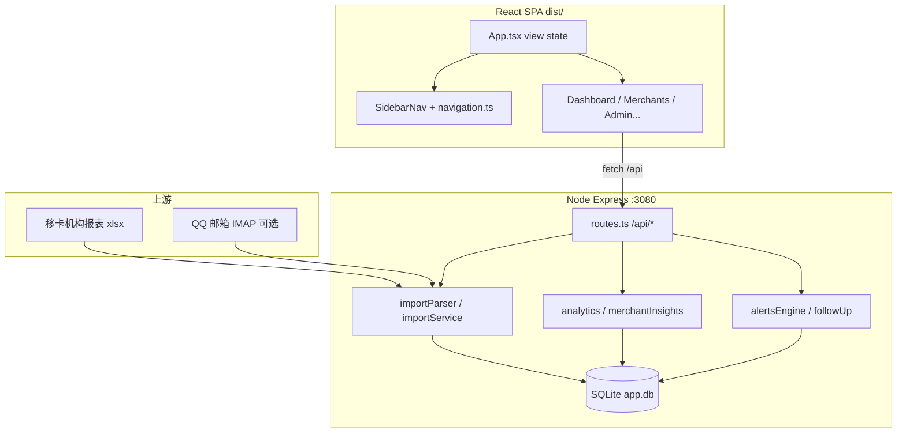

# 立得香港看板 · AI 助手交接指南

> **用途**：给 Cursor / 新 AI 助手或新开发者。**读完本文应能独立改功能、查 bug、发版。**  
> **最后更新**：2026-07-22  
> **Mac 路径**：`/Users/xin/projects/hk.orblead`（历史亦写作 `sales-data-agent`）  
> **生产**：https://hk.orblead.com · 服务器 `43.136.25.181:3080` · 目录 `/opt/sales-data-agent`  
> **最新部署**：2026-07-22 `npm run deploy`（bundle `index-DShxu6RJ.js` / `index-fY-5nZAv.css`）

---

## 〇、给 AI 的开场白（用户可直接复制）

```
我在维护 sales-data-agent（立得香港商户交易看板）。
请先完整阅读 docs/立得香港看板-AI助手交接指南.md，再动手改代码。

关键约束：
1. 三角色：admin / leader / sales。Leader 工作台 = 本人商户；团队数据在「我的團隊」。
2. 销售登录名 users.username 须与移卡 Excel「業務員」列一致（如 sam202512），不是 display_name。
3. 前端无 react-router，路由在 src/App.tsx 的 view state；侧栏在 src/config/navigation.ts。
4. 机构报表用 append 追加导入；勿用 sam202512.xlsx 个人文件修复交易额。
5. 发版：须用户明确说「部署」；部署前沙箱验证 + typecheck/自检。优先 `npm run deploy`；备用 tgz。勿 `restart`。
6. 改登入名、邮件自动导入：代码已有，生产启用前需与运营确认。
7. tools/alipay/ 与看板无关，不要上传服务器。
8. 若用户说「Phase 1/2/3」且语境是 AI/叙事/简报：指 §5.5「AI 叙事路线图」，不是「管理者洞察 Phase 1」或「导入匹配 Phase 1」。
```

---

## 一、项目是什么

| 项 | 说明 |
|----|------|
| **npm 包名** | `merchant-transaction-agent` |
| **业务** | 移卡机构每日交易 Excel → SQLite → 销售/主管/admin Web 看板 |
| **用户** | 7 位销售 + 主管 + admin；销售户外用手机 |
| **上游** | 邮件附件 `54516685_機构交易數據報表_YYYY-MM-DD.xlsx`（含 **業務員** 列） |
| **技术栈** | Node 22 + Express 5 + SQLite（Node 内置 `node:sqlite`）+ React 19 + Vite + Recharts + Docker |

**不要混淆**：`tools/alipay/` 是本地实验，与看板部署无关。

---

## 二、架构总览



**请求路径**：浏览器 → Nginx（hk.orblead.com）→ Docker `app:3080` → `dist/` 静态 + `/api/*`。

---

## 三、目录与关键文件

### 3.1 根目录

| 路径 | 说明 | 上传生产 |
|------|------|----------|
| `src/` | React 前端源码 | 否（打包进 `dist/`） |
| `server/` | Express 后端源码 | 否（编译进 `dist-server/`） |
| `dist/`、`dist-server/` | 构建产物 | **是** |
| `data/` | 本地 SQLite（可 200MB+） | **否**（生产用 Docker 卷） |
| `numbers/` | 测试用机构 Excel | **否**（deploy-pack 已排除） |
| `tools/` | 沙箱脚本、验证脚本 | **否** |
| `docs/` | 文档 | 可选 |
| `.cursor/rules/` | Cursor 规则（发版、账号、UI） | 可选 |
| `scripts/` | 部署打包脚本 | 否 |
| `release/` | 打好的 `.tgz` 部署包 | 否 |
| `secrets/` | 私钥等 | **否** |
| `deploy/` | 一键发版脚本 + Nginx 示例 | 是（`push-and-deploy.sh`） |

### 3.1.1 配置文件

| 文件 | 说明 |
|------|------|
| `.env` | JWT 等（Mac 可选，**服务器必须有**） |
| `.env.example` | 环境变量模板 |
| `docker-compose.yml` | Docker 启动（`Dockerfile.prod`） |
| `Dockerfile.prod` | **生产用**：直接用 dist，不在服务器编译 |
| `vite.config.ts` | 前端构建 |

**不要**把 `tools/alipay/.env` 或 `tools/alipay/.venv/` 当成看板配置上传。

### 3.1.2 三个环境别混

| | Mac 项目文件夹 | 腾讯云 `/opt/sales-data-agent` |
|--|----------------|--------------------------------|
| 改代码 | ✅ | ❌ 尽量只解压 / `--build` |
| `.env` | 本地测试用 | **生产 JWT** |
| `tools/alipay/` | 本地实验 | **不要上传** |
| 数据库 | `data/app.db` | Docker 卷 `sales-data-agent_app-data` |

### 3.2 后端模块（`server/`）

| 文件 | 职责 |
|------|------|
| `index.ts` | 启动、Vite 中间件（dev）或静态 dist（prod） |
| `routes.ts` | **所有 HTTP API**、权限中间件 |
| `db.ts` | Schema 初始化、迁移、`runTransaction` |
| `auth.ts` | JWT、登录、`UserRole` |
| `access.ts` | 商户读/写权限（admin / leader 团队 / sales 本人） |
| `importParser.ts` | 解析移卡 xlsx |
| `importService.ts` | 导入逻辑、**商户编号优先匹配** |
| `analytics.ts` | 统计、商户列表、**工作台图表聚合** |
| `merchantInsights.ts` | 新沉默 / 下跌中 / 上涨 分类 |
| `insightRules.ts` | 下跌阈值等 admin 可配项 |
| `alertsEngine.ts` | 预警计算、`countAlertsForUser` |
| `followUp.ts` | 跟进记录、附件 |
| `tigerTeam.ts` | Admin 飞虎队 |
| `leaderTeam.ts` | Leader 团队、成员关系表 |
| `paymentChannel.ts` | 刷卡/扫码/Mastercard；**境外卡** = 卡歸屬地外地/境外卡 + Visa/MC/银联 |
| `mastercardRank.ts` | 万事达累计排名 API |
| `overseasCard.ts` | 境外卡概览：**本月排名**（MTD 至昨日）、同卡多笔、大额单笔 |
| `emailImport/run.ts` | 邮件自动导入（生产未配） |

### 3.3 前端模块（`src/`）

| 文件 | 职责 |
|------|------|
| `App.tsx` | **唯一路由中枢**（`view` state，无 react-router） |
| `config/navigation.ts` | 侧栏项、角色可见性、Leader scope 文案 |
| `components/AppLayout.tsx` | 侧栏 + 主内容区布局；**手机登出**、**回顶** FAB |
| `components/AppShell.tsx` | 页头（标题/subtitle），包在 AppLayout 内 |
| `components/ScrollToTopButton.tsx` | 长列表监听 `.app-content` 平滑回顶（对齐 ali N7） |
| `pages/DashboardPage.tsx` | 三角色工作台入口（挂载环比起承） |
| `components/WorkbenchNarrative.tsx` | 工作台「称呼→起→承」叙事条 UI |
| `utils/workbenchNarrative.ts` | 环比起承文案生成（无 LLM） |
| `components/AdminDashboardPanel.tsx` | Admin 六块图表 + 排行榜 |
| `components/PersonalDashboardPanel.tsx` | Sales / Leader **本人**图表 |
| `components/DashboardChartsCore.tsx` | 销售/Leader 共用图表 |
| `components/dashboardChartParts.tsx` | 图表 tooltip、排行榜、donut 片段 |
| `pages/LeaderTeamPage.tsx` | Leader **团队**视图 |
| `pages/MerchantsPage.tsx` | 商户列表（insight 筛选、排序；**桌面表头吸顶**） |
| `utils/dailyAvgChange.ts` | 日均环比底数规则（与 `server/analytics.ts` 一致） |
| `pages/AdminPage.tsx` | 后台：导入、用户、阈值、开发者主题 |
| `pages/OverseasCardPage.tsx` | 境外卡交易页（排名 / 同卡多笔 / 大额） |
| `api/client.ts` | 前端 API 类型与 `fetch` 封装 |
| `context/AuthContext.tsx` | 登录态 |
| `context/DevThemeContext.tsx` | Admin 主题（仅 admin 生效） |
| `styles/index.css` | 全局样式（含侧栏、图表、移动端） |

---

## 四、本地开发

```bash
cd /Users/xin/projects/hk.orblead
cp .env.example .env    # 填 JWT_SECRET
npm install
npm run dev             # http://localhost:3080，Vite HMR
npm run build           # dist + dist-server
npm run typecheck       # 前后端 TS 检查
```

### 沙箱（推荐）

```bash
npm run sandbox:open    # → http://localhost:3090，data/sandbox-live.db
```

| 账号 | 密码 | 说明 |
|------|------|------|
| admin | admin123 | 全机构 |
| sam202512 | sales123 | Leader 兼销售测试 |

**沙箱故意行为**：启动时把一半 7 月商户挂到 Winnie，模拟 sam 归属错误 → sam 默认约 29.4 万（非 bug）。append 导入 org 7/1 报表后应 ~52.6 万；**重启沙箱会重置**。

完整数据：复制生产 `app.db` → `data/sandbox-live.db`，`DATABASE_PATH=./data/sandbox-live.db npm run dev`。

### 4.1 零基础首次运行（新电脑）

1. 安装 [Node.js LTS](https://nodejs.org/)（`node -v` / `npm -v` 有输出即可；**无需 Xcode**）
2. 进入项目：`cd /Users/xin/projects/hk.orblead` → `npm install`
3. 配置：`cp .env.example .env`，填 `JWT_SECRET`（至少 32 位）
4. 启动（二选一）：
   - **沙箱（推荐）**：`npm run sandbox:open` → http://localhost:3090
   - **开发模式**：`npm run dev` → http://localhost:3080（勿用 5173，须同一进程带 API）
5. 登录：`admin` / `admin123`；销售测试 `sam202512` / `sales123`
6. 导入：admin → **後臺管理** → 导入机构报表（**append 追加**；勿随便全量 replace 生产数据）
7. 外网上线：见 **`docs/外网部署指南.md`**

| 现象 | 处理 |
|------|------|
| 登录 404 | 必须用 `npm run dev` 或沙箱，地址 **3080/3090** |
| 销售看不到商户 | 检查 Excel **業務員** 列是否与 `users.username` 一致（如 sam202512） |
| 关掉终端网站停了 | 正常；下次再启动 |

> 更详细的零基础图文步骤见 **`docs/archive/新手操作指南.md`**（部分内容已过时，以本文为准）。

---

## 五、角色、权限与界面（方案 B · 2026-07-11 定稿）

### 5.1 角色定义

| role | 数据范围 | 侧栏特点 |
|------|----------|----------|
| `admin` | 全机构 | 飛虎隊、全部商戶、後臺管理 |
| `leader` | 本人 + 团队成员商户 | 我的團隊、我的與團隊商戶 |
| `sales` | 仅本人归属商户 | 我的商戶 |

**Leader 团队关系**：表 `leader_team_members(leader_user_id, sales_user_id)`，后台 admin 维护。

### 5.2 工作台分流（重要）

| 角色 | 页面 | 数据 scope | 组件 |
|------|------|------------|------|
| admin | 工作台 | 全机构 | `AdminDashboardPanel` |
| leader | 工作台 | **本人** | `PersonalDashboardPanel` + scope 文案 |
| leader | 我的團隊 | **团队** | `LeaderTeamPage` → `LeaderDashboardPanel` |
| sales | 工作台 | 本人 | `PersonalDashboardPanel` |

**Leader 易错点**：工作台图表、Hero、统计卡都是**本人**；点 insight 跳转商户列表要带 `salesFilter: "self"`（见 `openMerchants.ts`）。团队票房/成员排名只在「我的團隊」。

### 5.3 侧栏配置

编辑 **`src/config/navigation.ts`** 的 `NAV_ITEMS`：

- 新增入口：加 `NavKey`、图标、`roles` 过滤
- 商户文案：`merchantsNavLabel(role)` → admin 全部 / leader 我的與團隊 / sales 我的
- **`App.tsx`** 同步：`MainView` 类型、`activeNavFromView`、`renderView` switch

### 5.4 前端路由模型（无 react-router）

`App.tsx` 用 `useState<View>` 切换页面，侧栏 `onNavigate` 设置 `{ type: "dashboard" }` 等。

**View 类型**包括：`dashboard`、`merchants`（可带 `viewSort`、`salesFilter`）、`merchant`（下钻，带 `from` 回退）、`tigerTeamSales`、`leaderTeamSales` 等。

**滚动恢复**：列表页进商户详情再返回，用 `sessionStorage` + `mainScroll.ts` 恢复位置。

**下钻页保留「返回」**；侧栏一级页（工作台、列表）无返回按钮。

### 5.5 AI 叙事路线图（环比起承 · 易与其它 Phase 1 混淆）

**官方叫法**：优先说 **「工作台环比起承」** 或 **「AI 叙事 Phase N」**，避免单独说「Phase 1」。

| 名称 | 做什么 | 状态 |
|------|--------|------|
| **AI 叙事 Phase 1 · 工作台环比起承** | 页头下称呼 + 两段正文（不展示「起／承」字），模板文案，**无 LLM** | ✅ 2026-07-18 首版；**2026-07-22** 手机 hero 内展示 + 本月 MTD + 英绿文案 |
| **AI 叙事 Phase 2 · Sales/Leader AI 简报** | 人视角今日简报 | 未做 |
| **AI 叙事 Phase 3 · 预警 AI 解读** | 单条预警解释与跟进建议 | 未做 |

**仓库里其它也叫 Phase 1 的（已完成，勿混）**：

- **管理者洞察看板 Phase 1**：飞虎队 / 团队 / 销售详情 insight  
- **导入商户匹配 Phase 1**：`merchant_code` 优先匹配  

#### Phase 1 定稿（已实现）

| 项 | 定稿 |
|----|------|
| 挂载 | **桌面**：`DashboardPage` AppShell 标题下、Hero 之上；**手机**：Hero 卡片内顶部（`workbench-narrative--in-hero`） |
| 结构 | 称呼一行 + 起一段 + 承一段（**不展示「起／承」字样**，仅内部分段） |
| 样式 | 正文 `--racing-green`（`#004225`） |
| 称呼 | `{displayName}，您好。`（缺名则「您好。」） |
| 起 | 上月 vs 上上月；**显式月份**；总额环比 + 日均环比；**含本月 MTD**（截至昨日） |
| 承 | 上涨/下跌/新沉默结构句；**Leader** 句尾加团队未跟进预警偏多的销售（`GET /leader/team`） |
| 缺数据 | 保留称呼；起改说明句；承不写 |
| 代码 | `WorkbenchNarrative.tsx` + `workbenchNarrative.ts` |

---

## 六、核心业务指标

### 6.1 Insight 商户分类（与预警不同）

| 指标 | 定义 | 配置 |
|------|------|------|
| **本月 MTD** | 本月 1 日 00:00 ～ 昨日 23:59 交易额 | — |
| **日均环比** | 本月日均 vs 上月日均 % | 上月 **< 100 HKD 或为负** → 按 **10 HKD** 作底数估算，封顶 **±999.9%**；列表 hover 提示「估算」。逻辑：`calcDailyAvgChangePercent`（`server/analytics.ts` + `src/utils/dailyAvgChange.ts`） |
| **新沉默** | 上月完整月 > 0 且本月 MTD = 0 | — |
| **下跌中** | 本月 MTD > 0 且日均环比 < **-阈值** | admin 可调，默认 **10%** |
| **上涨** | 本月 MTD > 0 且日均环比 > 0 | — |
| **预警跟进** | alerts 表 week/month 未 ack | 阈值默认 **30%**，与下跌中独立 |

逻辑：`server/merchantInsights.ts`；阈值：`server/insightRules.ts` → 表 `insight_settings`。

### 6.2 销售账号与导入

- Excel **`業務員`** 列 → 匹配 **`users.username`**（不是 `display_name`）
- 展示名仅 UI 用（如 Sam）
- 7 人定稿：Winnie202512、sam202512、Char202605、Khloe202606、Alex202604、Ivy202604、JT2026
- 旧账号（如 `sam`）应停用
- 后台 **改登入名**：`PUT /api/users/:id` + `username`；自动 `syncMerchantSalesAssignment()` — **生产启用前与运营确认**

### 6.3 交易额不一致排查（sam202512 等）

| 现象 | 原因 | 修复 |
|------|------|------|
| 看板偏少 vs 机构 Excel | 商户 `sales_user_id` 错或未导入机构报表 | admin **append** 导入 `54516685_機构交易數據報表_*.xlsx`（勿指定销售）→ **同步商户归属** |
| 再导 sam202512.xlsx | 全重复跳过 | **无效**，不要用 |

### 6.4 境外卡交易（2026-07-18 定稿）

数据源：机构报表列 **`卡歸屬地`**（解析写入 `transactions.card_region`）。取值常见 **`外地`**（54516685/54516643 机构日报）；部分导出为 **`境外卡`**。二者都算境外。

| 区块 | 规则 |
|------|------|
| **统计范围** | `card_region ∈ {外地, 境外卡}` **且** 支付渠道为 Visa / Mastercard / 银联；成功消费（`amount > 0`）；不含微信/支付宝扫码、不含失败单 |
| **本月排名 Top 10** | **本月 1 日～昨日** 境外卡成功额（与看板 MTD 口径一致）；API 字段 `currentMonthRank`（保留 `lastMonthRank` 别名兼容旧前端） |
| **同卡多笔（近 3 日）** | 同一商户 + 同一卡号；单笔 **HKD 3,000–5,000**；≥ 2 笔；含银联（勿只算 Visa/MC） |
| **大额单笔（近 3 日）** | 单笔 ≥ HKD 50,000 |

**无数据时**：旧机构报表无「卡歸屬地」列 → 排名/近 3 日区块可能为空；须 **append** 含该列的机构日报（约 7/17 起）后，重复导入会**批量补空** `card_region`（见 §10.5）。

代码：`paymentChannel.ts`（`OVERSEAS_CARD_TXN_SQL`）· `overseasCard.ts` · `OverseasCardPage.tsx`。  
导入：`importParser` 读列 → `importService` 写入 `card_region`。  
重复订单默认不改（方案 A）；**仅当**本文件含该 `order_no` 且库中卡歸屬地为空时，**批量**补写该字段（不覆盖已有值、不改金额；只补列不重算预警）。

---

## 七、API 地图（常用）

前缀 **`/api`**，JWT：`Authorization: Bearer`（`AuthContext` 存 localStorage）。

| 方法 | 路径 | 角色 | 说明 |
|------|------|------|------|
| POST | `/auth/login` | 公开 | 登录 |
| GET | `/auth/me` | 登录 | 当前用户 |
| GET | `/stats/overview` | 登录 | **工作台总接口**（见 §八） |
| GET | `/leader/team/overview` | leader | 团队页图表 |
| GET | `/leader/team` | leader | 团队成员列表（可 sort） |
| GET | `/leader/team/:id` | leader | 成员详情 |
| GET | `/tiger-team` | admin | 飞虎队列表 |
| GET | `/tiger-team/:id` | admin | 销售详情 |
| GET | `/merchants` | 登录 | 商户列表（role 过滤 + insight） |
| GET | `/merchants/:id` | 登录 | 商户详情 |
| GET | `/merchants/mastercard-ranking` | 登录 | 万事达排名 |
| GET | `/overseas-cards/overview` | 登录 | 境外卡 |
| GET | `/alerts` | 登录 | 预警列表 |
| GET | `/card-failures` | 登录 | 交易失败 |
| POST | `/import/...` | admin | 手工/自动导入 |
| GET/PUT | `/insight-settings/*` | admin | 下跌阈值等 |
| GET/PUT | `/users/*` | admin | 用户、团队、改登入名 |
| POST | `/import/auto` | `X-Import-Key` | 邮件自动导入入口 |

完整列表见 **`server/routes.ts`**（约 1200 行，改 API 先 grep 是否已有）。

---

## 八、工作台数据流（改图表必读）

### 8.1 `GET /stats/overview`（`routes.ts`）

按角色返回不同字段：

| 字段 | admin | leader | sales |
|------|:-----:|:------:|:-----:|
| `merchantCount` | ✅ COUNT | ✅ | ✅ |
| `unreadAlerts` / `totalAlerts` | ✅ COUNT | ✅ | ✅ |
| `adminCharts` | ✅ | — | — |
| `personalCharts` | — | ✅ | ✅ |
| `homeInsight` | — | ✅ | ✅ |
| `alertDigest` | ✅ 周报 | — | — |
| `monthlyStats` / `tigerTeam` / `dailyTrend` | ❌ 已废弃返回 | — | — |

### 8.2 图表聚合函数（`analytics.ts`）

| 函数 | 用途 |
|------|------|
| `getAdminDashboardCharts` | Admin 六图 + 飞虎队榜 + 票房榜 |
| `getPersonalDashboardCharts` | Sales / Leader **本人**四图 |
| `getLeaderDashboardCharts` | Leader **团队**页（含团队 salesRanking） |
| `getAdminDailyMonthCross` | 日交易双线（批量 SQL `queryDailyTotalsMap`） |
| `getAdminMonthCompare` | 自然月环比 |
| `merchantInsightFromList` | 从商户列表算四象限 |
| `merchantBoxOfficeFromList` | 票房榜 Top N |
| `countMerchantsForUser` | 仅计数，不拉全表 |
| `listMerchantsForUser` | 全量列表（**贵**，Admin 图表只调一次） |

**性能选项**：`getMonthlyStats(..., { includeWeeks: false })` — 工作台图表不要每周明细。

### 8.3 工作台 UI 顺序（含环比起承）

**共同（三角色）**：页头 →（Admin 可选 `AlertDigestBanner`）→ **`WorkbenchNarrative`（称呼→起→承）** → 其余内容。

**Admin（`AdminDashboardPanel`）**：

1. 统计卡（预警、商户数、失败）
2. 月度趋势（6 月）
3. 环比柱图 + 商户动态 mini donut
4. 日交易双线（`DailyCrossChartTooltip` 移动端多行）
5. 飞虎队排名 + 商户票房（`HorizontalRankBoard`，`previewLimit={5}`）

**Sales / Leader**：叙事条 → Hero（MTD）→ 统计卡 → `PersonalDashboardPanel` 图表。

---

## 九、数据库要点

SQLite 文件：`DATABASE_PATH`（默认 `./data/app.db`）。

| 表 | 关键字段 |
|----|----------|
| `users` | `username`, `display_name`, `role`, `enabled` |
| `merchants` | `name`, `merchant_code`, `sales_user_id`, `sales_name` |
| `transactions` | `merchant_id`, `txn_time`, `amount`, `order_no`, `pay_wallet`, `card_no`, `card_region`, `batch_id` |
| `import_batches` | 导入批次 |
| `alerts` | `period`, `acknowledged`, 环比消息 |
| `leader_team_members` | leader ↔ sales 归属 |
| `insight_settings` | 下跌阈值、万事达高亮线等 |
| `follow_ups` / `admin_follow_up_reads` | 跟进与已读 |

Schema 与迁移在 **`server/db.ts`** 的 `initSchema()`（启动时执行）。

---

## 十、常见修改场景（AI 操作手册）

### 10.1 新增侧栏页面

1. `navigation.ts`：加 `NavKey` + `NAV_ITEMS` 条目
2. `App.tsx`：`MainView`、`activeNavFromView`、`<AppLayout>` 内 `renderView`
3. 新建 `src/pages/XxxPage.tsx`，用 `AppShell` 包内容
4. 如需 API：`server/routes.ts` + 业务模块 + `api/client.ts` 类型
5. `npm run typecheck`

### 10.2 改工作台图表

1. 后端：改 `analytics.ts` 对应 `get*DashboardCharts`
2. 类型：`src/api/client.ts` 的 `AdminDashboardCharts` / `PersonalDashboardCharts`
3. 前端：`AdminDashboardPanel` 或 `DashboardChartsCore` / `dashboardChartParts`
4. **Recharts tooltip**：默认 `whiteSpace: nowrap` 会截断；用 `CHART_TOOLTIP_STYLE` 或自定义 tooltip（参考 `DailyCrossChartTooltip`）

### 10.3 改 Leader scope 文案

- 常量：`LEADER_PERSONAL_SCOPE_HINT`（`navigation.ts`）
- 页面：`DashboardPage.tsx`、`PersonalDashboardPanel.tsx`、`AlertsPage.tsx`
- 跳转：`onOpenMerchants({ viewSort, salesFilter: "self" })`

### 10.4 改 insight 规则

1. `merchantInsights.ts` 分类逻辑
2. `insightRules.ts` 阈值读写
3. Admin 后台 UI：`AdminPage.tsx` rules section
4. 商户列表展示：`MerchantsPage.tsx`、`MerchantStatusTag.tsx`

### 10.5 改导入逻辑

1. `importParser.ts` 列映射（含 **`卡歸屬地` → `cardRegion`**）
2. `importService.ts` 商户匹配（**编号优先**）；成功交易写入 `card_region` / `card_no`
3. **append 重复导入性能**（2026-07-18，生产已发版）：
   - 文件内订单号 **批量 IN 查询**（非逐行 SELECT）
   - 已存在 `order_no` → 跳过商户 upsert 与 INSERT
   - 补空卡歸屬地 → **单次 UPDATE + 临时表**（非逐单 UPDATE）
   - 仅有新交易时 **`recomputeAlertsForMerchants`（按商户）**；纯重复/只补列 **不重算预警**
   - 有新交易的预警/同步：`runImportPostProcessing`，在 **HTTP 响应返回后** `setImmediate` 执行（导入接口先返回）
4. 重复订单：仅补空的 `card_region`（本文件订单号；不覆盖已有）
5. 后台上传 UI：`upload.ts` 小文件也触发 upload 进度；`AdminPage` 多文件进度只增不减
6. 测：`tools/verify-import-matching.ts`、`tools/verify-org-import-sandbox.ts`

### 10.6 改境外卡规则

1. 判定 SQL：`paymentChannel.ts`（`OVERSEAS_CARD_REGION_SQL` / `OVERSEAS_CARD_TXN_SQL`）
2. 阈值与列表：`overseasCard.ts`（**本月**排名窗口、同卡区间、大额门槛、近 3 日窗口）
3. 文案：`OVERSEAS_CARD_SCOPE_NOTE`、`OverseasCardPage.tsx`（加载失败显示错误，非无限转圈）
4. 须用**含卡歸屬地**的机构报表 append 后才有数据；勿用「全是 Visa/MC」当境外卡

### 10.7 只改样式

- 全局：`src/styles/index.css`
- Admin 主题：`DevThemeContext` + `themeTokens.ts`（**仅 admin**）
- 移动端：搜索 `@media (max-width:` in `index.css`

---

## 十一、2026-07-11 大改版摘要

> 当前生产目标包：`sales-agent-20260711-1749.tgz`

| 类别 | 内容 |
|------|------|
| **导航** | 侧栏替代首页卡包；Sales 移除「摘要」侧栏项 |
| **工作台** | 方案 B；Admin 六图；Leader 本人/团队分离 |
| **新页** | 萬事達排名（≥100万入榜，130万 warn，160万 alert）、境外卡交易（首版） |
| **后台** | 開發者視圖迁入後臺管理；改登入名已有 |
| **性能** | Admin overview 去冗余 SQL；日交易 2 次批量查询；alert COUNT |
| **移动端** | 日交易 tooltip 多行 + `reverseDirection` |
| **打包** | `deploy-pack.sh` 排除 `numbers/` |

### 11.1 2026-07-18 · 境外卡按「卡歸屬地」修正（✅ 已发版）

| 项 | 内容 |
|----|------|
| **判定** | 不再把全部 Visa/MC/银联当境外卡；须 `card_region` 为 **外地** 或 **境外卡** |
| **导入** | 新单写 `card_region`；重复单仅补空的卡歸屬地（本文件订单） |
| **同卡多笔** | 单笔 **3,000–5,000**（原误为 3,500）；含 **银联** |
| **排名** | 首卡由「上月 Top 10」改为 **「本月 Top 10」**（1 日～昨日） |
| **样例表** | `54516643_機构交易數據報表_2026-07-17.xlsx`（含外地 + 卡号） |

### 11.2 2026-07-18 · 导入性能 + 上传体验（✅ 已发版）

| 项 | 内容 |
|----|------|
| **现象** | 22KB 重复 append 在生产 ~88 万笔库上极慢、占满 CPU、整站卡住 |
| **根因** | Node 单线程 + 逐行 SQL / 全库预警重算；**非**带宽或 CPU 规格不足 |
| **修复** | 批量查单、批量补列、订单快路径、按商户重算预警、响应后异步 post-processing |
| **Nginx** | `/api/import` 超时 600s（防 504；优化后通常数秒内完成） |
| **进度条** | 小文件 upload 事件补全；多文件进度不回跳；失败有错误提示 |
| **发版** | 当日多次 `npm run deploy`；运营已确认导入与境外卡页可用 |

### 11.3 2026-07-22 · 商户列表 + 手机体验 + 叙事增强（✅ 已发版）

| 项 | 内容 |
|----|------|
| **发版** | `npm run deploy`；bundle `index-DShxu6RJ.js` / `index-fY-5nZAv.css` |
| **商户列表** | 桌面端 **表头吸顶**（`.app-content` 滚动，`--table-head-sticky-top` 对齐嵌入页头）；手机 card 模式仍隐藏 thead |
| **日均环比** | 上月 < 100 HKD 或为负 → 底数 **10 HKD**，±**999.9%** 封顶；`MerchantsPage` tooltip 标明估算 |
| **工作台叙事** | 手机 Hero 内展示环比起承；文案含 **本月 MTD**；英绿 `#004225` |
| **手机壳** | 右上角 **登出**；长页 **回顶** FAB（`ScrollToTopButton`，对齐 ali N7） |

**发版后验证**：强制刷新 → 商户列表桌面下拉表头吸顶；小额上月商户日均环比无 ±千万 %；手机工作台见叙事 + 登出 + 回顶。

---

## 十二、发版

```bash
# 推荐：一键（本机 build → rsync → 远程 docker compose --build）
npm run deploy
# 等同：./deploy/push-and-deploy.sh

# 备用：打 tgz + OrcaTerm
npm run pack:deploy          # → release/sales-agent-YYYYMMDD-HHMM.tgz
npm run pack:frontend        # → release/sales-dist-*.tgz
```

⚠️ **禁止** `docker compose restart`（不更新镜像内 dist）。  
⚠️ rsync / 解压都**不要**覆盖生产 `.env`（含 `JWT_SECRET`）。  
⚠️ `Dockerfile.prod` 需要本机先产出 `dist` / `dist-server`（一键脚本会先 build）。

详见 **`docs/发版流程.md`**、**`.cursor/rules/deployment.mdc`**。

---

## 十三、邮件自动导入（代码有，生产未开）

| 项 | 值 |
|----|-----|
| 发件人 | `baseweb_report@yeahka.com` |
| 附件名 | `54516685_機构交易數據報表_YYYY-MM-DD.xlsx` |
| 入口 | `POST /api/import/auto` + `X-Import-Key` |
| 脚本 | `server/emailImport/run.ts` |
| Cron | `scripts/install-email-import-cron.sh`（10:25 HKT） |
| 环境变量 | `.env.example` 中 `QQ_IMAP_*`、`IMPORT_API_KEY` 等 |

**当前运营**：手工 append 上传机构报表。

---

## 十四、已知陷阱（勿踩）

| 陷阱 | 正确做法 |
|------|----------|
| Leader 工作台当团队数据改 | 团队数据在 `LeaderTeamPage` / `getLeaderDashboardCharts` |
| Admin 图表多次 `listMerchantsForUser` | 一次列表复用 insight + 票房 |
| Recharts 长 tooltip 手机截断 | 自定义多行 tooltip + `maxWidth` |
| 用个人 xlsx 修 sam 交易额 | append **机构报表** + 同步归属 |
| `restart` 发版 | 必须 `up -d --build` |
| 改登入名未经确认上生产 | 与运营对齐后再开 |
| 提交 `numbers/`、`.env` | deploy-pack 已排除；git 也不要提交 |
| `SalesInsightSummaryPage.tsx` | 侧栏已移除，文件 orphaned，可删可留 |
| 境外卡页全是 Visa/MC 却仍为空 | 须导入含 **卡歸屬地** 的新报表；旧记录无该列需 append 补空 |
| 境外卡页一直转圈 | 查 `/overseas-cards/overview` 是否 500/超时；接口失败应显示错误（2026-07-18 已修 UI） |
| 重复 append 很慢 / 整站卡死 | 勿升配带宽 CPU；用 §10.5 批量逻辑；避免导入时并发大量请求 |
| 同卡多笔只有 Visa/MC | 银联也要计入；区间为 **3000–5000** |
| 上月近零商户日均环比 ±千万 % | 须走 **10 HKD 底数** + 999.9% 封顶；勿裸算除法 |

---

## 十五、待办 / 未上线

- [x] **2026-07-18 一键发版**（环比起承 + 境外卡卡歸屬地 + 本月排名 + 导入性能 + 上传进度；`npm run deploy`）
- [x] **2026-07-22 发版**（表头吸顶 + 日均环比底数 + 手机叙事/登出/回顶；`npm run deploy`）
- [ ] 运营持续 append 含「卡歸屬地」的机构日报，验证境外卡「本月排名」与「近 3 日」数据量
- [ ] **AI 叙事 Phase 2**：Sales/Leader AI 简报（未开始）
- [ ] **AI 叙事 Phase 3**：预警 AI 解读（未开始）
- [ ] 7 位销售 username 与業務員一致，旧账号停用
- [ ] 邮件自动导入 `.env` + cron（暂缓）
- [ ] Admin 若仍慢：排行榜懒加载 / 商户聚合纯 SQL

---

## 十六、相关文档

| 文档 | 用途 |
|------|------|
| **本文** | AI / 开发者主交接（**首选**） |
| `docs/README.md` | docs 目录索引 |
| `docs/立得香港看板纪要.md` | 业务备忘、发版记录 |
| `docs/发版流程.md` | 发版 checklist（OrcaTerm 复制粘贴） |
| `docs/外网部署指南.md` | 首次上云、HTTPS、Nginx |
| `docs/archive/` | 已归档旧文档（勿作首选） |
| `.cursor/rules/*.mdc` | Cursor 规则（发版、账号、UI、**AI 叙事路线图**） |

---

## 十七、文档维护

**何时更新本文**：

- 新增侧栏页、角色权限变更
- 工作台 / overview API 结构变化
- 发版后更新 §十一 包名与 §十五 待办
- 新 AI 踩坑后写入 §十四

**发版记录简表**仍写在 `docs/立得香港看板纪要.md` §3.5；本文 §十一 写**架构级**摘要即可。

---

*维护者：发版或架构变更后同步更新「最后更新」日期与 §十一 部署包名。*
